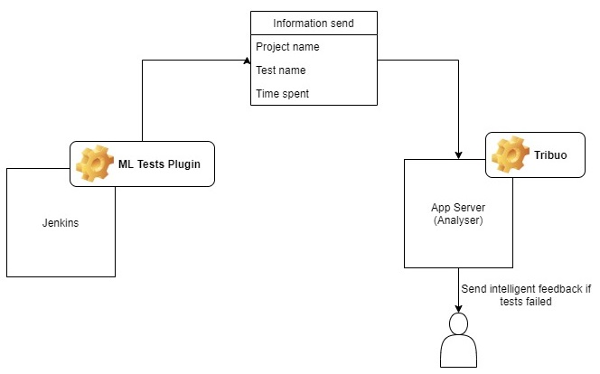

# Machine Learning (ML) Tests Jenkins Plugin

## Architecture overview



## Introduction

The ML Tests Jenkins plugin provides _yet another easy to use interface_ to report test results 
into [ML Tests for Learning](https://todo.com), right after the automated tests have run. The plugin wraps up the ML [public APIs](https://todo.com) to 
import test results from TestNG or JUnit result XML files. It can be used with any framework capable of generating JUnit files
like Robot/Cypress/NUnit amongst many others. 

## Getting started

### Installing the plugin

ML Tests Jenkins plugin can be installed from the Jenkins marketplace as below.
...ongoing...
1. Login to your Jenkins instance.
2. Go to Manage Jenkins > Manage Plugins > Available
3. Now search for ML Tests and click Install

### Requirements
1. Jenkins 2.235.1 or higher
2. ML cloud instance with ML Tests installed 

### Reporting results

The plugin works in the `post build actions` step, after the build steps are run.  
Assuming that the tests have run and a results xml (Junit/TestNG/any XUnit framework which generates a JUnit xml report)
has been generated, the ML Tests plugin can be used as below to report results of cases in the report XML to ML server.

1. Go to project -> Configure
2. Click on the Post Build Actions -> Select Publish Results to ML Tests
3. Specify the Project for which run results need to be published
4. Choose a framework and specify the path of the file - relative to the workspace eg. ```/target/surefire-reports/testng-results.xml```

      >For frameworks other than JUnit or TestNG, if results file is being generated in JUnit format, please select JUnit
5. Select preferences for results reporting
6. Specify the API Key generated from ML Tests in ML server.  Please refer [Generating API Key](https://mlreports.atlassian.net/wiki/spaces/ATDoc/pages/484048912/Access+Token)
for more information

|Field                | Details                                                                                         |
|-------------------- | -------------------------------------------------------------------------------------------------                     |
| Cycle Preference    | Select between existing and new cycle                                                              |
| Cycle Prefix        | In case of new cycle, Cycle prefix will be used to prefix the cycle title                          |
| Cycle Key           | If existing cycle is selected, ML Tests cycle key eg. SCRUM-CY-121                                |
| Add Case            | If checked, cases not already in cycle are added, else the cases are reported as errors            |
| Create Case         | If checked and no case exists with a matching case key or automation key, a new case is created    |
| Hide Publish Result Details | If checked, it would hide testcase wise details                                                    |
| Fail build if result publishing fails     | If checked, the build result will be updated to failed, in case publishing results fails      |

### Reporting results in pipeline

The ML Tests Jenkins plugin has support for being run as a pipeline task.  
For security of API Key, secret text credentials can be used to avoid putting the key in plain text.
Below is an example.

```
pipeline {
       agent any
       environment {
           ML_TESTS_API_KEY = credentials('mlTestApiKey')
       }
       stages {
           stage('SCM') {
               steps {
                   git 'https://github.com/org/sample-testng-tests.git'                       
               }
           }
           stage('Build') {
               steps {
                   sh 'mvn test'
               }
           }
       }
       post {
           always {
                   mlImport frameworkType : 'TestNG',
                         addCaseToCycle :true,
                         createCase :true,
                         entry: [$class: 'NewCycle', cyclePrefix: 'Regression Run V1.0'],
                        //For existing cycles : entry: [$class: 'ExistingCycle', cycleKey: 'SCRUM-CY-191'],
                         apiKey : hudson.util.Secret.fromString(env.ML_TESTS_API_KEY),
                         resultsFilePath : '/target/surefire-reports/testng-results.xml',
                         projectKey: 'SCRUM',
                         hideDetails: false
               
           }
       }
   }
```

### Parameters
If the job is a parameterized build, the plugin supports parametrization. 


## Support

For any issues or enhancements, please reach out @ [ML issue tracker](https://todo.com).


## About ML Tests

[ML Tests for ML Server](https://todo.com) is a plugin to check the unit tests 

To learn more, please have a look at our extensive [documentation](https://toadd.com).  

## License

Licensed under Apache License 2.0, see [LICENSE](LICENSE.md)
